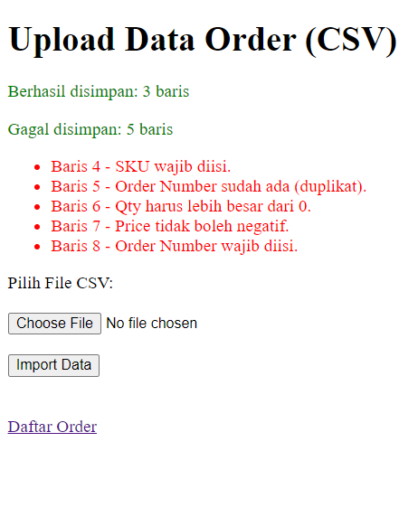
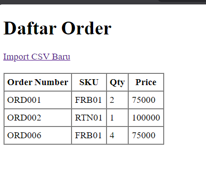

# Technical Test - Order Management

Aplikasi untuk *upload* data order dari file CSV ke database menggunakan Laravel.

## Hasil Tampilan

- **Form Upload CSV**: 
- **Daftar Order**: 

## Format CSV

Header pada baris pertama diabaikan. Format urutan kolom:
1. `order_number` (tidak boleh kosong/duplikat)
2. `sku`
3. `qty` (angka bulat > 0)
4. `price` (angka tidak boleh negatif)

---

## Cara Menjalankan (Running Locally)

1. **Install & Setup awal**
   ```bash
   git clone https://github.com/purnomoyusgiantoro/Technical-tes.git
   cd Technical-tes
   composer install
   cp .env.example .env
   php artisan key:generate
   ```

2. **Konfigurasi Database (.env)**
   Pastikan Anda memakai SQLite dan driver session disimpan ke database:
   ```env
   DB_CONNECTION=sqlite
   SESSION_DRIVER=database
   ```
   *(Catatan: Karena menggunakan session database, aplikasi akan error jika Anda tidak menjalankan `migrate` di bawah gunakan SESSION_DRIVER=file).*

3. **Migrasi Database & Jalankan**
   ```bash
   php artisan migrate
   php artisan serve
   ```
   Buka aplikasi di browser: [http://localhost:8000](http://localhost:8000)
